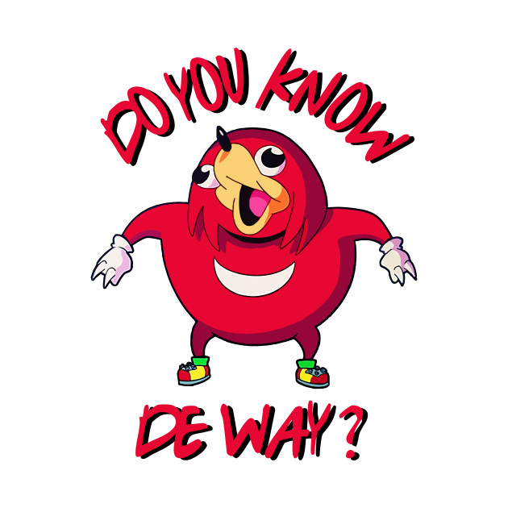

# Заключение

Итак, теперь вы изучили основы React hooks и теперь знаете как использовать менеджер состояния Redux, но что делать дальше?

Искать интересные статьи, которые поднимут ваши навыки и знания React.js на новый уровень!

