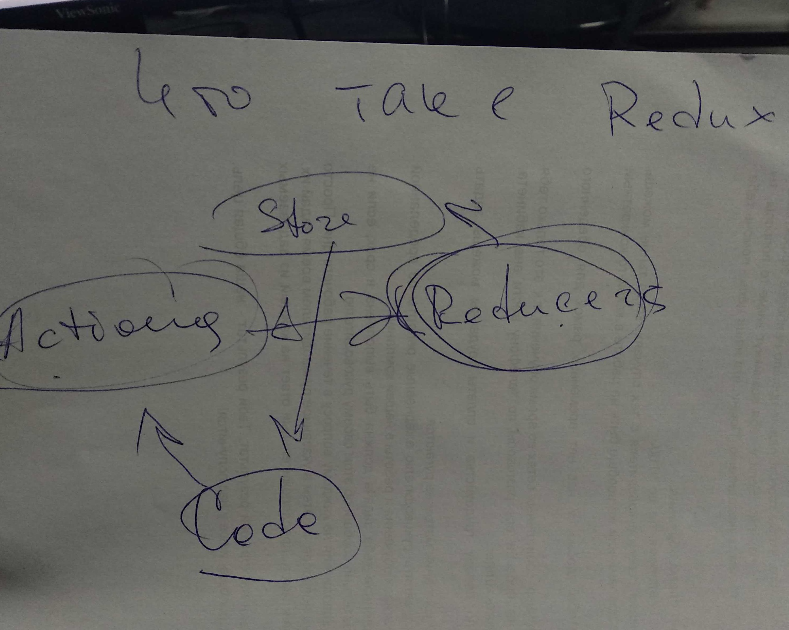

# Что такое Redux

Redux — это менеджер состояний. 

Чаще всего его используют с React, но его возможности не ограничиваются одной этой библиотекой. Хотя в React есть собственный метод управления состояниями \(Context\), он плохо масштабируется. Перемещение состояния вверх по дереву работает для простых приложений, но в более сложных архитектурах изменение состояния производится через свойства \(props\). Ещё лучше делать это через внешнее глобальное хранилище.

### Когда нужно пользоваться Redux?

Redux идеально подходит для средних и крупных приложений. Им стоит пользоваться только в случаях, когда невозможно управлять состоянием приложения с помощью стандартного менеджера состояний в React или любой другой библиотеке.

Простым приложениям Redux не нужен.

### Первый шаг на пути к изучению Redux

Начать свое знакомство с Redux и понять что это такое можно из этой схемы:

Все очень легко из кода мы вызываем какой либо `Action` в который передаем `payload`\(те данные которые хотим изменить\), в свою очередь `Action`запускают `Reducer`. `Reducer`высчитывает новое состояние и записывают его в `Store`. Из `Store` мы получаем новый `state`. Это и есть весь Redux.

Дальше можно перейти к основам и понять как это все реализуется.

